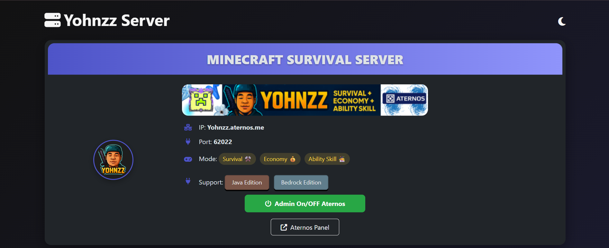

  

<h1 align="center">🌐 Minecraft Server Web Panel</h1>

  

---

  
  
  
  
  

---

## 🚀 Features
- 🔄 **Admin On/Off Aternos** → tombol cepat untuk mengaktifkan atau menonaktifkan server.  
- ⚡ **Aternos Panel Shortcut** → akses instan ke dashboard Aternos.  
- 🔌 **Plugins Manager** → tombol menuju halaman daftar plugins (UI clean + responsive).  
- 📊 **Server Information** → menampilkan:
  - Status server  
  - Players online  
  - RAM usage  
  - Jumlah plugins  

---

## 🎨 UI/UX Highlights
✨ Dibangun dengan fokus pada tampilan modern & user-friendly:  
- Modern design dengan **Bootstrap 5** + custom CSS.  
- **Hover effect** dan **pulse animation** di semua tombol.  
- Clean card layout dengan ikon **Font Awesome**.  
- Responsive & mobile-friendly.  

  

---

## 🛠️ Tech Stack

  
  

---

## 🌟 Star History

---

## 📬 Connect

  
  
  

